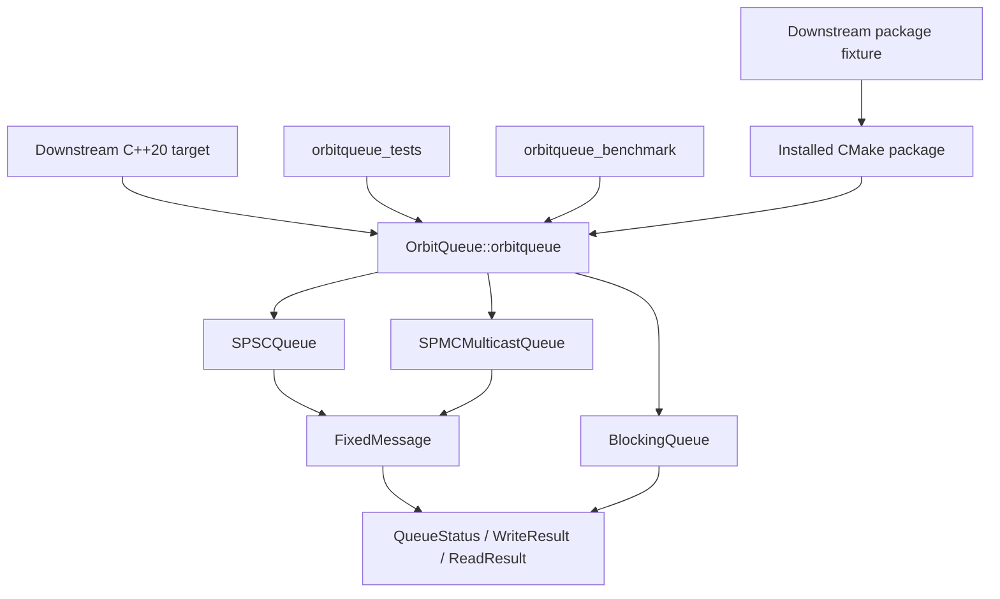

# OrbitQueue v2 Project Context

> Comprehensive repository context for OrbitQueue v2, including the parity
> migration merged into `main` at commit
> `88b87f08a4fe749a30077c599de22c1f6d54e5a4`, audited on 2026-06-22.

## 1. Document Purpose and Evidence Model

This document is the detailed technical and product map for the current
OrbitQueue v2 repository. It is intended to let a contributor understand the
project without reconstructing its design from commit history, headers, tests,
and build output.

The repository remains the source of truth. When statements conflict, use this
priority order:

1. Public header behavior and CMake configuration.
2. Automated tests that exercise that behavior.
3. Contract and architecture documentation.
4. This context document.
5. Historical discussion and the legacy OrbitQueue repository.

This document distinguishes four kinds of statements:

- **Contract:** behavior callers may rely on within the documented usage model.
- **Implementation:** how the current version realizes the contract.
- **Validation:** behavior exercised by automated or manual checks.
- **Limitation:** behavior that is absent, unsupported, or not established.

It is a snapshot, not a formal specification or proof of correctness.

## 2. Executive Summary

OrbitQueue v2 is a small, header-only C++20 concurrency research library for
fixed-size in-memory queues. Its purpose is to study explicit bounded-queue
contracts with correctness checks and semantically honest measurement.

The repository currently provides three queue families:

| Type | Producer/consumer model | Delivery model | Overflow model | Synchronization |
| --- | --- | --- | --- | --- |
| `BlockingQueue<T>` | Multiple producers and consumers | Work sharing | Producers wait or receive `full` from `try_push` | Mutex and condition variables |
| `SPSCQueue<N>` | Exactly one producer and one consumer | Work sharing | Rejects new writes with `full`; no unread overwrite | Acquire/release atomics |
| `SPMCMulticastQueue<N>` | One producer and multiple registered consumers | Multicast | Old history may be overwritten; consumers detect lag | One mutex for publication and reads |

The project includes:

- bounded `std::span` payload APIs;
- explicit status, byte-count, and sequence results;
- a dependency-free test harness;
- deterministic contract tests and a 50,000-message SPSC concurrency test;
- AddressSanitizer, UndefinedBehaviorSanitizer, and ThreadSanitizer build paths;
- separate SPSC and multicast smoke benchmarks with JSON-line output;
- safe blocking MPMC and optional Boost.Lockfree benchmark baselines;
- one, three, and ten-consumer matrices where queue contracts permit;
- a relocatable CMake package export and downstream-consumer test;
- Debug and Release GitHub Actions jobs on Ubuntu;
- architecture, contract, benchmark, and legacy documentation.

OrbitQueue v2 is experimental. It is not presented as production-ready,
formally verified, wait-free, lock-free, the fastest queue, or a drop-in
replacement for Boost or another queue library.

V2 is the supported successor and useful-value replacement for the original
OrbitQueue prototype. It does not preserve unsafe source or API compatibility.

## 3. Product Goals and Non-Goals

### 3.1 Current goals

- Make delivery semantics explicit before comparing performance.
- Reject invalid capacity and payload boundaries predictably.
- Keep raw queue storage inaccessible to callers.
- Detect ordinary boundary states through inspectable result values.
- Prevent data races in supported use through conservative synchronization.
- Keep the core library portable and free of mandatory third-party packages.
- Make tests and sanitizer runs independent gates from benchmarks.
- Allow standard CMake installation and downstream `find_package` usage.
- Preserve enough measurement metadata to interpret each emitted count.

### 3.2 Current non-goals

- Multiple producers for `SPSCQueue` or `SPMCMulticastQueue`.
- Persistent, distributed, inter-process, or network queues.
- Dynamic payload sizes beyond a compile-time maximum per queue type.
- A stable ABI; the project is header-only and template-heavy.
- Timed blocking operations or cancellation tokens.
- A lock-free multicast implementation.
- Formal linearizability, progress, or memory-model proofs.
- Statistical benchmark claims, latency studies, or historical chart parity.
- Full API or implementation compatibility with the legacy repository.

## 4. Repository and Release State

| Attribute | Current value |
| --- | --- |
| Local path | `/Users/suhaasgaddala/orbitqueue-v2` |
| GitHub repository | `https://github.com/suhaasgaddala/orbitqueue-v2` |
| Visibility | Public |
| Default branch | `main` |
| Package baseline | `1f943660fa76e866555a5cad312efe4035f51c44` |
| Parity migration commit | `88b87f08a4fe749a30077c599de22c1f6d54e5a4` |
| Active branch | `main` |
| Project version | `2.0.0` |
| License file | MIT, copyright 2026 OrbitQueue contributors |
| Tags | None |
| GitHub releases | None established by this repository |
| Published baseline branch | `main` |
| Core form | Header-only CMake interface library |
| Required language | C++20 |
| Minimum CMake | 3.20 |

The repository history through the parity migration has three commits:

1. `42b2733` - `Initial OrbitQueue v2 foundation`
2. `1f94366` - `Add installable CMake package`
3. `88b87f0` - `Complete v1 parity migration`

The parity migration is described in `docs/v1_parity_audit.md`; final retirement
gates are tracked in `docs/v1_deletion_checklist.md`.

The tracked MIT license exists even though GitHub's repository metadata did not
yet report a detected SPDX license during the 2026-06-22 audit.

## 5. Complete Repository Map

```text
orbitqueue-v2/
|-- .github/
|   `-- workflows/
|       `-- ci.yml                         Ubuntu Debug/Release CI
|-- .gitignore                             Build and local artifact exclusions
|-- CMakeLists.txt                         Root target, options, install/export
|-- LICENSE                                MIT license
|-- PROJECT_CONTEXT.md                     This detailed repository snapshot
|-- README.md                              User-facing overview and quick start
|-- benchmarks/
|   |-- CMakeLists.txt                     Benchmark executable definition
|   |-- benchmark_support.h                JSON and sequence-range helpers
|   `-- queue_benchmark.cpp                Full contract-aware scenario matrix
|-- cmake/
|   `-- OrbitQueueConfig.cmake.in          Installed package configuration
|-- docs/
|   |-- architecture.md                    High-level implementation rationale
|   |-- benchmarking.md                    Metric semantics and benchmark limits
|   |-- v1_deletion_checklist.md           Final manual retirement gates
|   |-- legacy/
|   |   |-- LICENSE.v1                     Original artifact attribution
|   |   |-- README.md                      Historical labels and caveats
|   |   |-- assets/
|   |   |   |-- benchmark_v1_historical.png
|   |   |   `-- spmc_global_indices_v1.png
|   |   `-- v1_project_context.md          Full archived v1 technical audit
|   |-- legacy_context_summary.md          Why v2 is separate from the prototype
|   |-- queue_contracts.md                 Supported queue behavior
|   `-- v1_parity_audit.md                 Complete migration disposition
|-- include/
|   `-- orbitqueue/
|       |-- blocking_queue.h               Bounded blocking MPMC queue
|       |-- fixed_message.h                Bounded fixed-size payload storage
|       |-- result.h                       Status and operation result types
|       |-- spmc_multicast_queue.h         Conservative multicast ring
|       |-- spsc_queue.h                   Atomic bounded SPSC ring
|       `-- version.h                      Compile-time version constants
`-- tests/
    |-- CMakeLists.txt                     Test executable and package test
    |-- blocking_queue_tests.cpp           Blocking, close, FIFO, wakeup tests
    |-- benchmark_support_tests.cpp        Matrix, range-union, JSON tests
    |-- downstream/
    |   |-- CMakeLists.txt                 External package consumer fixture
    |   `-- main.cpp                       Installed-header/runtime smoke test
    |-- fixed_message_tests.cpp            Payload boundary and copy tests
    |-- run_downstream_test.cmake           Install/configure/build/test driver
    |-- spmc_multicast_queue_tests.cpp      Cursor, multicast, lag, move tests
    |-- spsc_queue_tests.cpp                Boundary, FIFO, and concurrency tests
    |-- test_main.cpp                       Dependency-free test entry point
    `-- test_support.h                      Assertion and object-byte helpers
```

There is no compiled core source directory because all public implementation is
in templates or inline functions under `include/orbitqueue`.

## 6. Architectural Model



The principal architectural rule is that a queue contract precedes its
optimization. Capacity, ownership, delivery, ordering, overflow, shutdown, and
progress semantics must be stated before throughput numbers can be meaningful.

### 6.1 Ownership boundaries

- A queue owns all of its slots and synchronization state.
- Callers provide bounded spans for payload input and output.
- No public API returns a slot pointer or accepts a raw ring index.
- `SPMCMulticastQueue::Consumer` holds a non-owning pointer to its queue.
- Consumer handles must not outlive the queue that created them.
- Queue types are non-copyable. Mutex/atomic members also prevent meaningful
  implicit moves of the queue objects in the current implementation.

### 6.2 Sequence model

- Successful SPSC writes and multicast publications begin at sequence `1`.
- Sequence `0` is used by several unsuccessful results where no publication
  sequence exists.
- SPSC `head_` is both the successful-write count and next sequence basis.
- SPSC `tail_` is the successful-pop count.
- Multicast `published_sequence_` is the latest successful publication.
- `uint64_t` exhaustion is not handled by either ring implementation.

## 7. Shared Result API

All shared result types live in namespace `orbitqueue` in `result.h`.

```cpp
enum class QueueStatus {
    success,
    empty,
    full,
    closed,
    message_too_large,
    invalid_capacity,
    invalid_consumer,
    consumer_lagged,
    overwritten,
    would_block
};

struct WriteResult {
    QueueStatus status;
    std::uint64_t sequence;
};

struct ReadResult {
    QueueStatus status;
    std::size_t bytes_read;
    std::uint64_t sequence;
};
```

### 7.1 Status semantics and current usage

| Status | Intended meaning | Emitted by current code |
| --- | --- | --- |
| `success` | Operation completed | All queue/message implementations |
| `empty` | Non-blocking read found no available message | `BlockingQueue::try_pop`, `SPSCQueue::try_pop`, multicast consumer |
| `full` | Non-blocking write found no capacity | `BlockingQueue::try_push`, `SPSCQueue::try_push` |
| `closed` | Queue is closed to the requested operation | `BlockingQueue` |
| `message_too_large` | Input exceeds fixed capacity or output span is too short | `FixedMessage`, SPSC, multicast |
| `invalid_capacity` | Reserved status for capacity validation | Not emitted; constructors throw `std::invalid_argument` |
| `invalid_consumer` | Consumer handle is unusable | Moved-from multicast consumer |
| `consumer_lagged` | Consumer cursor fell behind retained multicast history | Multicast consumer |
| `overwritten` | Expected multicast slot contains another sequence | Defensive multicast path; not expected under ordinary mutex-protected invariants |
| `would_block` | Reserved non-blocking state | Not emitted by current code |

`ok(status)` returns true only for `success`. `to_string(status)` returns stable
lowercase names for every declared enumerator and `"unknown"` for an invalid
enumerator value.

## 8. FixedMessage

`FixedMessage<MaxPayloadSize>` is the common slot payload type for the two ring
queues.

### 8.1 Storage

- `std::array<std::byte, MaxPayloadSize>` payload storage.
- `std::size_t size_` for the active payload length.
- `std::uint64_t sequence_` for the associated publication sequence.
- Value initialization produces zero size, zero sequence, and zeroed storage.

### 8.2 Write behavior

`assign(payload, sequence)`:

1. Rejects `payload.size() > MaxPayloadSize` with `message_too_large`.
2. Leaves existing message state unchanged on that rejection.
3. Copies exactly the input bytes for accepted payloads.
4. Stores the accepted size and sequence.
5. Returns `{success, sequence}`.

Zero-length payloads are valid. `MaxPayloadSize == 0` is structurally valid for
`FixedMessage`, although no dedicated zero-capacity-payload queue test exists.

### 8.3 Read behavior

`copy_to(destination)`:

- rejects a destination shorter than the active payload using
  `message_too_large`;
- reports zero bytes read on rejection;
- does not modify message state;
- copies exactly `size_` bytes on success;
- leaves bytes beyond `size_` in the destination unchanged;
- returns the stored sequence on success and short-destination rejection.

The same status name describes both an oversized input and an undersized output
buffer. Callers distinguish them from operation context.

## 9. BlockingQueue Contract and Implementation

`BlockingQueue<T>` is a bounded, mutex-protected FIFO supporting multiple
producers and multiple consumers.

### 9.1 Construction and ownership

- The constructor accepts a runtime capacity.
- Capacity zero throws `std::invalid_argument`.
- Capacity is immutable after construction.
- Copy construction and copy assignment are deleted.
- There is no explicit move API.

### 9.2 Operations

| Operation | Open and available | Open at boundary | Closed with items | Closed and empty |
| --- | --- | --- | --- | --- |
| `push(const T&)` | Copies item, returns `success` | Waits for space | Returns `closed` | Returns `closed` |
| `try_push(const T&)` | Copies item, returns `success` | Returns `full` | Returns `closed` | Returns `closed` |
| `pop()` | Removes FIFO item | Waits for item | Drains FIFO item | Returns `std::nullopt` |
| `try_pop(T&)` | Moves FIFO item to destination | Returns `empty` | Drains FIFO item | Returns `closed` |
| `close()` | Marks closed and wakes all waiters | Same | Idempotently remains closed | Same |

`closed()` reads the state under the mutex. `capacity()` returns the immutable
capacity without locking.

### 9.3 Synchronization

- One mutex protects queue storage and closure state.
- `not_empty_` blocks consumers.
- `not_full_` blocks producers.
- Blocking predicates include `closed_` to guarantee wakeup on shutdown.
- Successful blocking operations unlock before notifying one opposite waiter.
- `close()` notifies all producer and consumer waiters.

### 9.4 Type and exception considerations

- `push` and `try_push` require behavior compatible with copying `T` into
  `std::queue<T>`.
- `pop` constructs its result by moving from the front item.
- `try_pop` move-assigns into the caller's destination.
- Allocation and user-defined copy/move operations may throw.
- Mutex-acquiring methods are intentionally not declared `noexcept`.
- There are no timed waits, stop tokens, size inspection, reopen, or clear APIs.

## 10. SPSCQueue Contract and Implementation

`SPSCQueue<MaxPayloadSize>` is a bounded work-sharing FIFO for exactly one
producer and exactly one consumer.

### 10.1 Contract

- One producer thread may call `try_push`.
- One consumer thread may call `try_pop`.
- Additional producers or consumers violate the contract.
- Every successful publication can be popped once.
- Unread slots are never overwritten.
- Capacity and maximum payload size are independent: capacity is runtime slot
  count; payload limit is a template argument.
- There are no blocking, close, or timed operations.

### 10.2 Ring representation

- `slots_` is a vector of `FixedMessage<MaxPayloadSize>` allocated at
  construction.
- `head_` counts successful publications.
- `tail_` counts successful pops.
- The producer uses slot `head % capacity`.
- The consumer uses slot `tail % capacity`.
- `head_` and `tail_` are individually aligned to 64 bytes to reduce likely
  false sharing; this is an implementation hint, not a portable cache-line
  guarantee.

### 10.3 Producer algorithm

1. Reject an oversized payload before reading queue counters.
2. Load `head_` with relaxed ordering.
3. Load `tail_` with acquire ordering.
4. Report `full` when `head - tail == capacity`.
5. Assign the payload and sequence `head + 1` into the selected slot.
6. Publish the completed slot by storing the new head with release ordering.

Only the producer writes `head_` and the selected unpublished slot.

### 10.4 Consumer algorithm

1. Load `tail_` with relaxed ordering.
2. Load `head_` with acquire ordering.
3. Report `empty` if the counters are equal.
4. Copy the selected slot into the caller's destination.
5. Advance `tail_` with a release store only after a successful copy.

If the destination is too short, the read returns `message_too_large` and does
not consume the message. The caller can retry with a larger destination.

### 10.5 Observer methods

- `empty()` compares acquire loads of head and tail.
- `full()` checks whether their difference equals capacity.
- These are instantaneous observations, not reservations; concurrent progress
  can make the returned value stale immediately.

### 10.6 Unsupported boundaries

- `uint64_t` counter exhaustion and resulting sequence wrap are not handled.
- Contract correctness depends on one producer and one consumer.
- No formal proof accompanies the memory-ordering implementation.
- The implementation has sanitizer and sequence tests, not exhaustive state
  exploration or model checking.

## 11. SPMCMulticastQueue Contract and Implementation

`SPMCMulticastQueue<MaxPayloadSize>` is a bounded multicast ring with one
producer and independently advancing consumer handles.

### 11.1 Delivery semantics

This queue is not an exclusive work-sharing SPMC queue. Each consumer that was
registered before a publication may read that publication independently.
Reading does not remove the message for other consumers.

New consumers start at `published_sequence + 1`. They do not replay history
that existed before registration.

### 11.2 Consumer handles

- `register_consumer()` snapshots the next publication sequence under lock.
- Handles are move-only.
- Moving transfers the queue pointer and cursor.
- A moved-from handle has a null queue pointer and returns `invalid_consumer`.
- `next_sequence()` exposes the logical cursor, not a ring index.
- The queue does not maintain a registry or ownership record for handles.
- Destroying a handle requires no queue operation.
- Destroying the queue before a live handle creates a dangling pointer; this is
  forbidden by contract and not detected at runtime.
- Concurrent operations on the same handle are not a supported usage model.

### 11.3 Publication

`try_publish(payload)`:

1. Rejects oversized payloads before acquiring the mutex.
2. Acquires the queue mutex.
3. Computes `sequence = published_sequence + 1`.
4. Selects slot `(sequence - 1) % capacity`.
5. Replaces that slot's payload, size, and sequence.
6. Updates `published_sequence_`.
7. Returns the assigned sequence.

Publication does not wait for slow consumers and does not report `full`.
Capacity limits retained history, not publication progress.

### 11.4 Retention and lag recovery

For current publication sequence `P` and capacity `C`, the oldest retained
sequence is:

```text
oldest = P >= C ? P - C + 1 : 1
```

When a consumer cursor is less than `oldest`:

1. The cursor is advanced to `oldest`.
2. The read returns `consumer_lagged` with sequence `oldest`.
3. No payload is copied on that call.
4. The next call can read the oldest retained publication.

The status counts a recovery event, not the exact number of publications lost.

### 11.5 Read behavior

All publication and payload-copy operations share one mutex. Therefore a
producer cannot rewrite a slot while a consumer copies it.

A caught-up consumer receives `empty` and its next sequence. A short output
span receives `message_too_large` without advancing the cursor. A successful
copy advances the cursor by one.

The `overwritten` branch checks that the selected slot's stored sequence equals
the expected cursor. Under ordinary mutex-protected operation and without
sequence exhaustion, earlier lag detection should preserve this invariant.
The branch is defensive rather than an expected routine result.

### 11.6 Progress and scaling properties

- The implementation is neither advertised nor implemented as lock-free.
- One mutex serializes the producer and every consumer copy.
- Consumer throughput and producer throughput contend on that mutex.
- Slow consumers do not block publication after releasing the mutex, but they
  can lose retained history.
- The single-producer restriction is contractual even though the mutex would
  serialize many aspects of accidental multi-producer use.
- There is no close, blocking read, wait notification, or consumer deregister
  operation.

## 12. Behavioral Invariants

The current design and tests depend on these invariants:

### 12.1 Shared payload invariants

- Active payload size never exceeds the template maximum after a successful
  assignment.
- Rejected assignments preserve the prior slot state.
- Successful reads report the slot's stored sequence and exact byte count.

### 12.2 Blocking queue invariants

- Stored item count never exceeds capacity.
- Closure is monotonic.
- Closure rejects every later push.
- Closure does not discard already queued items.
- FIFO order is preserved under mutex serialization.

### 12.3 SPSC invariants

- `tail <= head` in the supported pre-wrap sequence domain.
- `head - tail <= capacity`.
- Producer publication of head follows completion of slot writes.
- Consumer release of tail follows completion of slot copies.
- A slot is not selected for another producer write until the consumer releases
  its capacity.

### 12.4 Multicast invariants

- `published_sequence_` identifies the newest stored generation.
- At most `capacity` most-recent generations are retained.
- A valid consumer cursor advances monotonically except when moved directly to
  the oldest retained sequence during lag recovery.
- Mutex ownership excludes simultaneous payload rewrite and copy.

## 13. Build System

### 13.1 Core target

The root build defines:

```cmake
add_library(orbitqueue INTERFACE)
add_library(OrbitQueue::orbitqueue ALIAS orbitqueue)
```

The interface target provides:

- C++20 compile-feature requirement;
- source-tree and install-tree include directories;
- optional warning flags;
- optional sanitizer compile and link flags.

Because these properties are `INTERFACE`, consumers inherit them, including
consumers of an installed package generated from that build configuration.

### 13.2 Configuration options

| Option | Default | Effect |
| --- | --- | --- |
| `ORBITQUEUE_BUILD_TESTS` | `ON` | Includes CTest and adds `tests/` |
| `ORBITQUEUE_BUILD_BENCHMARKS` | `ON` | Builds `orbitqueue_benchmark` |
| `ORBITQUEUE_ENABLE_BOOST_BENCHMARKS` | `OFF` | Requests optional Boost.Lockfree scenarios |
| `ORBITQUEUE_ENABLE_WARNINGS` | `ON` | Enables project warning set on the interface target |
| `ORBITQUEUE_ENABLE_SANITIZERS` | `OFF` | Enables configured sanitizer flags |
| `ORBITQUEUE_SANITIZERS` | `address,undefined` | Comma-separated `-fsanitize` value |

`ORBITQUEUE_BUILD_TESTS`, rather than CTest's `BUILD_TESTING`, directly controls
whether the test directory is added.

### 13.3 Warning policy

- MSVC: `/W4 /permissive-`
- Clang/GCC: `-Wall -Wextra -Wpedantic -Wconversion -Wshadow`
- Other compilers: no project warning flags are added.

### 13.4 Sanitizer policy

- MSVC sanitizer configuration fails explicitly.
- Clang/GCC receive `-fsanitize=<value>` and
  `-fno-omit-frame-pointer` at compile time.
- Clang/GCC receive the matching sanitizer link option.
- Other compilers fail explicitly when sanitizers are requested.
- ThreadSanitizer should use a separate build from ASan because these tools are
  generally incompatible.

### 13.5 Dependencies

- Core headers require only the C++20 standard library.
- Tests and benchmarks use CMake's `Threads::Threads` target.
- Boost.Lockfree is discovered only for benchmarks when explicitly requested.
- Missing Boost headers warn and disable Boost scenarios without failing other
  targets.
- No external test framework or benchmark framework is required.
- The exported core target does not declare `Threads::Threads`; downstream
  users remain responsible for platform-specific thread linkage if their
  toolchain requires it.

## 14. Installation and Downstream Consumption

### 14.1 Installation contents

A default installation produces the logical structure:

```text
<prefix>/
|-- include/orbitqueue/*.h
|-- lib/cmake/OrbitQueue/
|   |-- OrbitQueueConfig.cmake
|   |-- OrbitQueueConfigVersion.cmake
|   `-- OrbitQueueTargets.cmake
`-- share/doc/OrbitQueue/LICENSE
```

Actual directory names follow `GNUInstallDirs` and may differ by platform or
user configuration.

### 14.2 Version compatibility

`OrbitQueueConfigVersion.cmake` uses CMake's `SameMajorVersion` compatibility.
A downstream request for version `2` is accepted by the current `2.0.0`
package. No components are defined.

### 14.3 Consumer API

```cmake
find_package(OrbitQueue 2 CONFIG REQUIRED)
target_link_libraries(my_target PRIVATE OrbitQueue::orbitqueue)
```

For nonstandard prefixes, consumers pass the prefix using `CMAKE_PREFIX_PATH`
or another normal CMake package-discovery mechanism.

### 14.4 Downstream package test

CTest's `orbitqueue_downstream_package` test:

1. Deletes a build-local test staging directory.
2. Installs the current build into an isolated prefix.
3. Configures `tests/downstream` using only that prefix.
4. Builds a consumer linked to `OrbitQueue::orbitqueue`.
5. Runs the consumer through its own CTest project.

The fixture checks package discovery, target export, installed includes,
version visibility, compilation, linking, and a one-message SPSC round trip.
It avoids source-tree include paths, preventing a broken install from passing
through accidental local-header discovery.

There is no package archive generator, package-manager manifest, `pkg-config`
file, uninstall target, or ABI compatibility promise.

## 15. Test Architecture and Coverage

### 15.1 Harness

`orbitqueue_tests` uses a minimal custom harness. `expect(condition, message)`
throws `std::runtime_error` on failure. `test_main.cpp` runs each suite in
sequence, prints one success line, and reports the first standard exception.

There is no test discovery by case, filtering, sharding, parameterization,
property-testing framework, or per-assertion reporting.

### 15.2 Coverage matrix

| Area | Covered behavior |
| --- | --- |
| `FixedMessage` | Zero, one, exact maximum, oversized input, state preservation, short output, byte and sequence round trip |
| `BlockingQueue` | Zero capacity, initial empty, bounded full, FIFO, blocked consumer wakeup, blocked producer wakeup, close, drain, rejected post-close push |
| `SPSCQueue` | Zero capacity, empty/full observers, empty pop, sequences, FIFO, no overwrite, oversized input, 50,000-message concurrent wraparound integrity |
| Multicast | Zero capacity, two independent consumers, caught-up empty, wraparound, lag recovery, moved-from invalidation, moved cursor preservation, oversized input |
| Package | Install prefix, config/version lookup, imported target, installed headers, compile/link/run |
| Benchmark support | Consumer matrix, monotonic range tracking, overlapping range union, duplicate rejection, exact JSON schema |
| Benchmark executable | CTest smoke run across every compiled scenario; nonzero validation errors fail the process |

### 15.3 Important uncovered or partially covered behavior

- No randomized or property-based operation sequences.
- No long-duration stress suite.
- No concurrent multicast stress test with producer and multiple readers.
- No multiple-producer/multiple-consumer blocking stress test.
- No forced sequence-counter wraparound.
- No exception-injection tests for user-defined `BlockingQueue<T>` operations.
- No zero-byte queue payload tests through SPSC or multicast.
- No retry test proving an undersized output does not consume a ring message.
- No tests for repeated `close()` calls.
- No direct test of multicast registration after prior publications.
- No test intentionally reaches the defensive `overwritten` result.
- No compile-only matrix for public headers independently.
- No Windows or macOS CI jobs.
- No installed-package test against the minimum supported CMake 3.20 binary.

Timing assertions in blocking tests use a 20 ms expected-block window and a
1 second wakeup deadline. They are practical smoke checks, not deterministic
scheduler proofs.

## 16. Benchmark Architecture

The benchmark executable runs contract-specific scenarios sequentially. It
defaults to 250 ms per scenario and accepts one optional duration in
milliseconds.

```sh
./build/benchmarks/orbitqueue_benchmark 1000
```

Zero duration and values that throw during `std::stoull` parsing are rejected.
Argument handling is intentionally small and is not a full command-line parser.

### 16.1 Fixed benchmark configuration

| Queue | Delivery | Consumers | Default |
| --- | --- | --- | --- |
| `spsc` | Exclusive SPSC work sharing | 1 | Yes |
| `spmc_multicast` | Independent multicast delivery | 1, 3, 10 | Yes |
| `blocking_mpmc` | Exclusive work sharing | 1, 3, 10 | Yes |
| `boost_lockfree_work_sharing` | Exclusive work sharing | 1, 3, 10 | Optional |

All scenarios use capacity 1024, one producer, and the same two-`uint64_t`
payload containing a sequence and its bitwise-complement checksum. SPSC is
never run with multiple consumers because that would violate its contract.

### 16.2 Output schema

Each run emits one JSON object per queue with these fields:

| Field | Meaning |
| --- | --- |
| `queue` | `spsc` or `spmc_multicast` |
| `capacity` | Runtime ring slot count |
| `payload_size` | Bytes per benchmark message |
| `producer_count` | Producer thread count |
| `consumer_count` | Consumer thread count |
| `duration_ms` | Requested producer run duration |
| `messages_published` | Successful producer operations |
| `aggregate_reads` | Total successful reads across consumers |
| `unique_sequences_verified` | Unique sequences whose payload matched sequence |
| `dropped_or_lagged` | Detected cursor recovery events, not exact skipped messages |
| `validation_errors` | Payload/sequence, duplicate/order, or work-sharing drain mismatches |

Any nonzero `validation_errors` makes the executable exit unsuccessfully.
Unique-sequence accounting stores monotonic ranges and merges their union,
keeping memory proportional to observed gaps rather than total messages.

### 16.3 SPSC measurement

- Producer increments a `uint64_t` payload after each successful push.
- Full results cause a thread yield.
- Consumer drains after the duration until the queue is empty.
- A compact monotonic range tracker records verified sequences.
- Aggregate reads and unique verified sequences should match publications.

### 16.4 Multicast measurement

- The configured one, three, or ten consumers register before producer start.
- Each consumer owns separate read, lag-event, and verified-sequence metrics.
- Consumers continue after stop until their cursor exceeds the published
  sequence.
- Producer publishes continuously; fixed-size publication normally succeeds.
- Final unique count is the union of both consumers' verified sets.
- Aggregate reads may exceed publications because delivery is multicast.

### 16.5 Blocking and Boost measurement

- Blocking MPMC uses `try_push` so the producer cannot remain blocked at stop.
- The producer closes the blocking queue and consumers drain until `pop()`
  returns `std::nullopt`; shutdown cannot strand an empty-queue waiter.
- Optional Boost uses a bounded compile-time-capacity queue.
- Boost consumers drain after observing a release/acquire producer-done flag.
- Both are work-sharing scenarios: successful reads should equal publications,
  and any drain or unique-count mismatch is a validation error.

Boost scenarios compile only when
`ORBITQUEUE_ENABLE_BOOST_BENCHMARKS=ON` and
`boost/lockfree/queue.hpp` is found. The core library never depends on Boost.

### 16.6 Interpretation limits

- SPSC unique pops and multicast aggregate reads are different units of work.
- Sequence-range tracking still adds correctness-accounting overhead.
- There is no warmup, cooldown, repeated-trial statistics, variance, confidence
  interval, affinity control, scheduler control, or latency distribution.
- Requested duration excludes some startup, drain, join, and reporting work.
- Machine, OS, compiler, build type, CPU topology, and git commit are not
  emitted in each result.
- Lag events do not quantify exact message loss.
- Boost's type name does not establish that every operation is lock-free on
  every platform.
- Benchmark completion is not evidence of race freedom or correctness.
- Results are smoke measurements and should not support ranking claims.

## 17. Continuous Integration

`.github/workflows/ci.yml` runs on every push and pull request.

The only job is an Ubuntu `build-and-test` matrix:

- `Debug`
- `Release`

Each matrix entry checks out the repository, configures tests and benchmarks,
builds with two parallel jobs, and runs CTest with failure output. Because the
downstream package check is registered in CTest, CI also validates installation
and consumption in both configurations. CTest also runs a short default
benchmark matrix and fails on reported validation errors.

CI currently does not run:

- ASan/UBSan;
- ThreadSanitizer;
- Windows or macOS builds;
- minimum-CMake compatibility;
- long-duration benchmarks or performance regression thresholds;
- formatting, static analysis, coverage, packaging archives, or release jobs.

The first public CI run for commit `1f94366` completed successfully in Debug
and Release. GitHub emitted a platform annotation that `actions/checkout@v4`
targets deprecated Node.js 20 and was being forced to Node.js 24. This did not
fail the run but is future maintenance work.

## 18. Documentation Set

- `README.md` is the concise user entry point.
- `docs/architecture.md` records why contracts precede optimization and why the
  legacy algorithms were not reused.
- `docs/queue_contracts.md` defines supported capacity, delivery, ordering,
  overwrite, shutdown, and ownership behavior.
- `docs/benchmarking.md` defines emitted metrics and why queue types cannot be
  ranked by unlike operation counts.
- `docs/legacy_context_summary.md` records the old prototype's relevant defects
  without importing its implementation.
- `docs/legacy/` preserves the original license attribution, both labeled
  historical images, and the full factual v1 context audit.
- `docs/v1_parity_audit.md` gives every v1 feature an explicit migration
  disposition and lists manual deletion checks.
- `PROJECT_CONTEXT.md` provides the exhaustive contributor snapshot.

## 19. Relationship to the Legacy OrbitQueue Repository

OrbitQueue v2 is the supported successor and useful-value replacement, not a
source-compatible archive. The original repository remains separate until the
manual deletion checks in the parity audit are complete.

### 19.1 Concepts retained and rebuilt

- Fixed-size in-memory queue research.
- A bounded blocking queue baseline.
- SPSC work-sharing behavior.
- Single-producer multicast behavior.
- Benchmarking as a research aid.

### 19.2 Legacy behavior deliberately excluded

- Callback-based raw writes into internal slot memory.
- Caller-managed raw ring indices.
- Unbounded or unchecked payload copies.
- Conflicting global header types.
- The unsafe per-slot SPMC synchronization algorithm.
- Hard-coded Homebrew, LLVM, or Boost paths.
- Mandatory Boost dependency.
- Benchmark comparisons across unlike payloads and delivery semantics.
- Historical charts without raw observations and environment metadata.
- Strong lock-free or performance claims unsupported by tests or proof.

### 19.3 Useful value recreated by the parity migration

- Optional Boost.Lockfree work-sharing comparisons without a core dependency.
- A non-hanging blocking MPMC benchmark.
- One, three, and ten-consumer matrices where contracts permit.
- Compact sequence validation and process-failing smoke checks.
- Historical architecture and benchmark imagery with explicit caveats.
- The original design inspiration and full factual v1 technical context.

### 19.4 Still missing by design or because it is irrecoverable

- Raw historical observations, chart-generation scripts, and machine metadata
  were never tracked and cannot be reconstructed from the v1 PNG.
- Exact unsafe v1 source is not embedded in v2.
- External GitHub issues, pull requests, stars, forks, redirects, and settings
  require a manual service-level check before v1 deletion.
- Full Git object history should be archived separately if provenance beyond
  the documented commit list is required.

## 20. Correctness and Safety Claims

### 20.1 Claims supported by implementation and current tests

- Zero runtime queue capacity is rejected.
- Oversized fixed payloads are rejected before slot mutation.
- Blocking queue closure wakes tested producer and consumer waiters.
- Queued blocking items remain drainable after closure.
- SPSC does not overwrite unread slots in the supported contract.
- SPSC preserves tested payload and sequence order across many wraparounds.
- Multicast consumers advance independently.
- Slow multicast consumers detect loss of retained history.
- Mutex serialization prevents simultaneous multicast payload copy and rewrite.
- Installed CMake packages can be found and consumed through the exported
  target in tested configurations.

### 20.2 Claims explicitly not made

- Formal correctness or linearizability proof.
- Lock-free or wait-free progress.
- Correctness outside declared producer/consumer ownership.
- Correct behavior near `uint64_t` exhaustion.
- Production readiness or stable API/ABI compatibility.
- Superior throughput or latency.
- Cross-platform behavior beyond tested environments and current Linux CI.

## 21. Risk Register

### 21.1 Correctness and concurrency risks

| Risk | Current mitigation | Remaining work |
| --- | --- | --- |
| Unsupported caller concurrency | Contracts state producer/consumer counts | Debug ownership assertions or stronger types could improve diagnostics |
| Sequence exhaustion | Documented as unsupported | Define wrap semantics or enforce operational limits |
| Consumer lifetime | Documented non-owning handle rule | Lifetime-safe ownership model or explicit invalidation |
| Multicast contention | Mutex guarantees payload exclusion | Equivalent stress tests before alternative synchronization |
| Timing-test flakiness | Generous 1 second completion deadline | Deterministic coordination primitives in tests |
| User type exceptions in blocking queue | Standard exceptions propagate | Exception-injection tests and documented guarantees |

### 21.2 Build and packaging risks

| Risk | Current state |
| --- | --- |
| Interface warning leakage | Installed consumers inherit warning options from the configured target |
| Interface sanitizer leakage | Packages installed from sanitizer builds inherit sanitizer flags |
| Thread linkage | Exported target does not declare `Threads::Threads` |
| Minimum-version drift | CMake 3.20 is declared but local validation used newer CMake |
| Platform breadth | Only Ubuntu CI; local validation used macOS Apple Clang |
| Package ecosystem | No package-manager recipes or release archives |

### 21.3 Benchmark and product risks

| Risk | Current state |
| --- | --- |
| Misleading comparisons | Documentation explicitly separates delivery semantics |
| Unreproducible performance | Environment and repeated-trial metadata remain absent |
| Measurement distortion | Sequence and checksum validation still occurs in the timed workload |
| API expectations from version `2.0.0` | Project remains experimental despite semantic version string |
| Documentation drift | No automated check links this snapshot to future commits |

## 22. Validation Record

### 22.1 Foundation validation

The initial foundation was validated with Apple Clang 17 using:

- direct warning-enabled compilation;
- Debug and Release CMake builds;
- CTest;
- ASan/UBSan;
- a separate ThreadSanitizer build;
- SPSC and multicast benchmark smoke runs;
- a tests-disabled, benchmarks-disabled minimal configuration.

### 22.2 Package milestone validation

The package milestone was validated from fresh build directories with:

- Debug configure, build, queue tests, and downstream package test;
- Release configure, build, queue tests, and downstream package test;
- ASan/UBSan build, queue tests, and downstream package test;
- ThreadSanitizer build, queue tests, and downstream package test;
- tests-disabled and benchmarks-disabled installation;
- Release benchmark smoke execution;
- `git diff --check` before commit.

### 22.3 Public CI validation

GitHub Actions run `27943583429` passed both Ubuntu Debug and Release jobs for
commit `1f943660fa76e866555a5cad312efe4035f51c44`.

### 22.4 V1 parity migration validation

The parity branch was validated locally with Apple Clang 17 and CMake 4.3.4:

- explicit Boost-off Debug configure and build: passed;
- Debug queue, downstream package, and benchmark smoke tests: passed;
- default Release configure and build: passed;
- Release queue, downstream package, and benchmark smoke tests: passed;
- default Release benchmark emitted seven valid JSON scenarios with zero
  validation errors: passed;
- ASan/UBSan tests with benchmarks disabled: passed;
- ThreadSanitizer tests with benchmarks disabled: passed;
- tests-disabled benchmark build: passed;
- benchmarks-disabled queue and downstream package tests: passed;
- Boost-requested configure with unavailable headers: emitted the documented
  warning, disabled only Boost scenarios, and passed the normal build/tests.

Boost headers were not installed, so an actual Boost scenario build and smoke
run were not available locally. This remains a portability check for a
Boost-equipped environment or CI job.

### 22.5 Validation interpretation

Passing sanitizers means those executed paths produced no reported sanitizer
failure in that environment. It is not proof that all schedules or unsupported
uses are race-free. Benchmark counts vary by run and are intentionally not
stored here as performance baselines.

## 23. Contributor Workflow

Before changing queue behavior:

1. State producer count, consumer count, delivery model, capacity behavior,
   overwrite behavior, ordering, and shutdown semantics.
2. Add or update a deterministic contract test first.
3. Preserve result-state inspectability and bounded payload handling.
4. Run Debug and Release warning-enabled builds.
5. Run CTest, including the downstream package test.
6. Run ASan/UBSan and TSan in separate builds for concurrency changes.
7. Run benchmarks only after correctness gates pass.
8. Treat performance changes as unproven until repeated measurements include
   environment metadata and comparable work definitions.
9. Update contracts, architecture notes, this context, and README when the
   public model changes.

Suggested baseline commands:

```sh
cmake -S . -B build-debug -DCMAKE_BUILD_TYPE=Debug
cmake --build build-debug --parallel
ctest --test-dir build-debug --output-on-failure

cmake -S . -B build-release -DCMAKE_BUILD_TYPE=Release
cmake --build build-release --parallel
ctest --test-dir build-release --output-on-failure

cmake -S . -B build-sanitize \
  -DCMAKE_BUILD_TYPE=Debug \
  -DORBITQUEUE_BUILD_BENCHMARKS=OFF \
  -DORBITQUEUE_ENABLE_SANITIZERS=ON \
  -DORBITQUEUE_SANITIZERS=address,undefined
cmake --build build-sanitize --parallel
ctest --test-dir build-sanitize --output-on-failure

cmake -S . -B build-tsan \
  -DCMAKE_BUILD_TYPE=Debug \
  -DORBITQUEUE_BUILD_BENCHMARKS=OFF \
  -DORBITQUEUE_ENABLE_SANITIZERS=ON \
  -DORBITQUEUE_SANITIZERS=thread
cmake --build build-tsan --parallel
ctest --test-dir build-tsan --output-on-failure
```

## 24. Prioritized Roadmap

### P0: Broaden correctness confidence

- Add randomized but reproducible operation-sequence tests with printed seeds.
- Add long-duration SPSC and multicast sequence/payload validation.
- Add concurrent multicast producer/consumer stress under TSan.
- Add blocking MPMC stress and deterministic close-race coverage.
- Test retry behavior after undersized output spans.
- Decide how sequence exhaustion is prevented or represented.

### P1: Strengthen portability and packaging

- Add sanitizer jobs to CI where runner support is reliable.
- Add macOS and Windows compiler coverage.
- Compile and smoke the optional Boost scenarios in a Boost-equipped CI job.
- Test against CMake 3.20 or revise the declared minimum.
- Decide whether warnings and sanitizer settings should propagate to installed
  consumers.
- Determine whether the exported target should carry a thread dependency.
- Update GitHub Actions away from the deprecated Node.js 20 action runtime.
- Add tagged releases and generated source/package archives when appropriate.

### P2: Make measurements reproducible

- Emit OS, CPU, compiler, standard library, build type, commit, and timestamp.
- Add warmup and repeated trials.
- Report per-trial results and summary statistics without discarding raw data.
- Separate correctness tracking overhead from throughput measurement.
- Add latency distributions and optional CPU affinity.
- Add further baselines only when payload and delivery semantics align.
- Track raw benchmark data and chart-generation scripts.

### P3: Investigate performance designs

- Profile the mutex-protected multicast implementation.
- Establish an equivalent stress and sanitizer suite before synchronization
  changes.
- Explore finer-grained or generation-aware synchronization only with an
  explicit proof argument and regression tests.
- Avoid using "lock-free" unless both algorithmic progress and correctness
  requirements are established.

## 25. Glossary

- **Capacity:** Maximum slot or item count retained by a queue.
- **Work sharing:** A successful read removes or claims work so one consumer
  processes each publication.
- **Multicast:** Multiple consumers independently observe the same publication.
- **Publication sequence:** Monotonically increasing logical message identity.
- **Consumer cursor:** Next multicast publication sequence a handle expects.
- **Lag:** Consumer cursor points to history older than the ring retains.
- **Aggregate reads:** Sum of successful reads across all consumers.
- **Unique verified sequences:** Union of sequences whose payload matched the
  sequence identity.
- **Lock-free:** A progress property not claimed by this project; it does not
  merely mean "contains no mutex."
- **Header-only:** Consumers compile implementation from headers; no OrbitQueue
  binary library is linked.

## 26. Snapshot Summary

OrbitQueue v2 currently succeeds as a clean experimental foundation: it has
explicit queue semantics, bounded APIs, conservative race avoidance, contract
tests, sanitizer paths, honest smoke benchmarks, installation support, and
working public CI. Its strongest property is not raw speed but inspectability:
ordinary boundary states are represented, delivery models are named, and
unsupported claims are documented.

The next phase should increase schedule coverage and reproducibility without
weakening those contracts. Optimization, additional baselines, and legacy
feature recreation remain secondary to correctness evidence.
