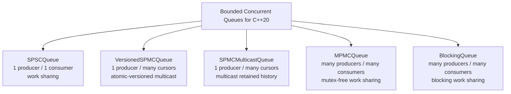
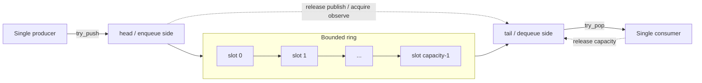
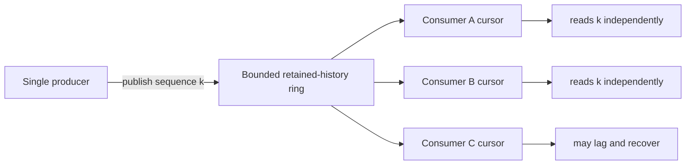
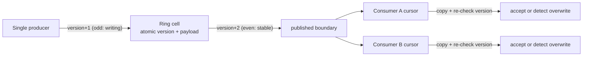
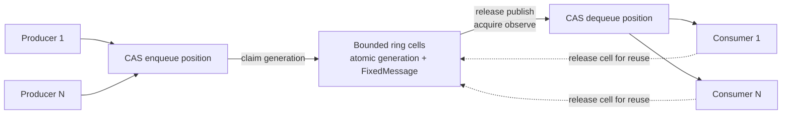
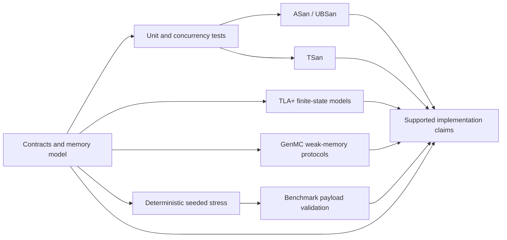

# Bounded Concurrent Queues for C++20

[](https://github.com/suhaasgaddala/Line64/actions/workflows/ci.yml)
[](https://github.com/suhaasgaddala/Line64/actions/workflows/verification.yml)
[](https://en.cppreference.com/w/cpp/20)
[](LICENSE)

Super-fast bounded concurrent queues for C++20: lock-free SPSC, atomic-versioned
SPMC, multicast SPMC, mutex-free MPMC, and mutex-backed baselines.

Line64 is a C++20 bounded concurrent queue library with lock-free SPSC,
atomic-versioned mutex-free SPMC, mutex-free MPMC, and mutex-backed blocking
queue implementations. The atomic-versioned SPMC path uses per-cell atomic
versioning to reduce global-index contention, complementing the conservative
multicast queue and the mutex-free MPMC and mutex-backed blocking baselines.

The project studies bounded in-memory queues with named producer and consumer
contracts, fixed-size payload storage where applicable, explicit operation
results, and benchmark scenarios that preserve the meaning of each delivery
model. Correctness checks and synchronization rationale are part of the design,
not inferred from throughput.

## Why bounded queues?

Bounded queues make capacity an explicit part of the contract. Producers cannot
hide unbounded memory growth behind an enqueue call, and consumers can reason
about exactly how much retained work or history exists at any point.

That tradeoff is useful for low-latency and systems code because storage can be
allocated up front, overload is reported as an operation result, and queue
semantics can stay specific: exclusive handoff, exclusive-pop work sharing, and
multicast retained history are different contracts with different measurement
rules.

## Queue Contracts

| Queue | Producers | Consumers | Synchronization | Progress / role |
|---|---:|---:|---|---|
| `SPSCQueue<N>` | 1 | 1 | Atomics | Lock-free SPSC exclusive handoff |
| `VersionedSPMCQueue<N>` | 1 | many | Per-cell atomic versioning | Atomic-versioned mutex-free SPMC path |
| `SPMCMulticastQueue<N>` | 1 | many | Mutex-protected publication/copy | Conservative multicast retained-history queue |
| `MPMCQueue<N>` | many | many | Atomics/CAS, no mutex | Mutex-free MPMC; no lock-free/wait-free claim |
| `BlockingQueue<T>` | many | many | Mutex + condition variable | Mutex-backed blocking baseline |

`VersionedSPMCQueue<N>` and `SPMCMulticastQueue<N>` expose the same multicast
retained-history contract; they differ only in synchronization. The versioned
queue is mutex-free and uses a per-cell seqlock, while the multicast queue uses
a single mutex across publication and copy.

The fixed-payload queues accept `std::span`, reject oversized messages, and
return explicit status, byte-count, and logical-sequence results. Queue
contracts differ intentionally: multicast observations are not exclusive pops,
and the MPMC short-destination policy consumes an already claimed message.

## Queue Family Overview



## SPSC Ring Flow



The producer owns `head`; the consumer owns `tail`. Release/acquire handoffs
publish completed payload bytes and prevent a slot from being reused while the
consumer is copying it.

`SPSCQueue` is the lock-free queue in the library: it uses atomic
producer/consumer indices with a single writer per index and provides
non-blocking `try_push` / `try_pop` operations. This lock-free claim is
intentionally scoped to the SPSC queue only.

## SPMC Multicast Flow



Each registered consumer advances an independent cursor. Reading does not
remove a publication for other consumers. Slow consumers can lose overwritten
history, receive `consumer_lagged`, and continue from the oldest retained
sequence.

## Atomic-versioned mutex-free SPMC path

`VersionedSPMCQueue<N>` is the mutex-free version of the multicast contract. It
adds a per-cell atomic-versioned SPMC implementation alongside Line64's existing
queue families. Instead of one global mutex, each ring cell owns an atomic
version counter used as a seqlock:



A consumer reads a cell's version, copies the payload, then re-reads the
version; if the value changed (or was odd) the snapshot was torn by an
overwrite and is discarded rather than returned. Every cell field is a relaxed
atomic guarded by release/acquire fences, so an overlapping read is always a
well-defined atomic access and never undefined behaviour.

Progress and claims for this queue are intentionally scoped: `try_publish` from
the single producer is wait-free, and each `try_read` is non-blocking and
completes in a bounded number of steps — under producer pressure it returns
`overwritten` or `consumer_lagged` instead of spinning. The library documents
this as the **atomic-versioned / mutex-free** SPMC path and does not extend a
blanket lock-free claim to it.

## Global-index SPMC design exploration

Early SPMC multicast designs can be explained with a small set of shared
sequence indices. A producer reserves a slot, writes the payload, and then
advances a published boundary once the message is visible. Consumers advance
their own cursor positions independently, while the slowest consumer determines
the oldest sequence that must remain retained.

This global-index style is conceptually related to David Gross's
[*Trading at Light Speed*](https://meetingcpp.com/mcpp/schedule/talkview.php?tid=220)
discussion of low-latency ring-buffer design and to Disruptor-style
claim/publish/gating models, including the
[LMAX Disruptor user guide](https://lmax-exchange.github.io/disruptor/user-guide/index.html)
and Trisha Gee's
[*Dissecting the Disruptor: Writing to the ring buffer*](https://trishagee.com/2011/07/04/dissecting_the_disruptor_writing_to_the_ring_buffer/).
The tradeoff is simple: shared sequence state makes the design easy to reason
about, but those shared indices can become contention points as producer and
consumer activity grows.

The current Line64 `SPMCMulticastQueue` is intentionally conservative and
mutex-protected around publication and payload copy. The diagram below is
design exploration, not a literal claim that the current implementation uses
this exact synchronization protocol.


## MPMC Sequence-Cell Flow



The enqueue and dequeue counters allocate unique positions with relaxed CAS.
Per-cell acquire/release generation values transfer ownership of ordinary
payload bytes. Capacity must be a power of two greater than one. The
implementation contains no mutex, but the project does not claim lock-free or
wait-free progress.

## Validation Pipeline



Each layer answers a different question. Tests exercise deterministic
contracts; stress explores many scheduled operations; sanitizers inspect
executed paths; TLC exhaustively checks finite models; GenMC explores reduced
protocols under the C/C++ weak-memory model; benchmark validation rejects
corrupt or inconsistent measured work. None is an unbounded refinement proof of
the complete C++ implementation.

## Performance tests and benchmarks

Line64 performance tests are grouped by delivery semantics before throughput is
compared. SPSC queues are compared only against SPSC exclusive-handoff
baselines. MPMC queues are compared only against exclusive-pop work-sharing
baselines. SPMC multicast is reported separately because aggregate consumer
observations are not directly comparable to exclusive-pop throughput.

### MPMC performance tests: exclusive-pop work sharing

Line64's MPMC queue is compared only against exclusive-pop work-sharing queues.
In the local Apple M4 performance-test run at capacity `32,768` with `64 B`
payloads, Line64 `MPMCQueue` ranked first in the tested `1P/1C` and `2P/2C`
scenarios against the measured baselines shown below.


| Queue | 1P/1C mean msg/s | 2P/2C mean msg/s |
|---|---:|---:|
| Line64 `MPMCQueue` | 1,895,855 | 3,379,918 |
| `boost::lockfree::queue` | 1,812,384 | 2,854,875 |
| `moodycamel::ConcurrentQueue` | 1,770,057 | 3,249,127 |
| `max0x7ba/atomic_queue` | 1,574,023 | 2,368,352 |
| Line64 `BlockingQueue` | 1,762,932 | 2,467,672 |

Only the topologies where Line64 ranked first are visualized above. The full
benchmark output should be read for other producer/consumer counts. In the same
run, other baselines were competitive or faster in some higher-contention
scenarios, so the project does not claim universal throughput dominance.

Performance-test snapshot environment: Apple M4, macOS, AppleClang Release
build, capacity `32,768`, payload `64 B`, `1s` measured per scenario after
`250ms` warmup, mean of `3` trials.

### SPSC performance tests: exclusive handoff

Line64 `SPSCQueue` is benchmarked only against SPSC exclusive-handoff baselines.
In local Apple M4 testing, Line64 remained competitive with `rigtorp/SPSCQueue`
and `boost::lockfree::spsc_queue` while preserving the project's fixed-payload
API, explicit status results, cache-layout isolation, and documentation-focused
design.

### SPMC performance tests: multicast retained history

Line64 `SPMCMulticastQueue` is reported separately. A single published message
may be observed by multiple consumers, so aggregate consumer observations can
exceed published message throughput. These results are useful for understanding
multicast retained-history behavior, but they are not directly comparable to
SPSC or MPMC exclusive-pop throughput.

The benchmark executable emits JSONL so charts can be regenerated from measured
output instead of hand-written numbers.

## Quick Start

Requirements: CMake 3.20 or newer and a C++20 compiler.

```sh
cmake -S . -B build -DCMAKE_BUILD_TYPE=Debug
cmake --build build --parallel
ctest --test-dir build --output-on-failure
```

Run the deterministic stress matrix:

```sh
./build/stress/orbitqueue_stress \
  --queue all --seed 12345 --duration-ms 250 --iterations 10000
```

Run one benchmark trial after configuring a Release build:

```sh
cmake -S . -B build-release -DCMAKE_BUILD_TYPE=Release
cmake --build build-release --parallel
./build-release/benchmarks/orbitqueue_benchmark \
  --duration-ms 250 --warmup-ms 50 --trials 1
```

The core library has no mandatory third-party dependency. Tests, benchmarks,
and stress support are enabled by default. Optional external benchmark
baselines remain disabled unless their `LINE64_ENABLE_*` or compatible
`ORBITQUEUE_ENABLE_*` CMake flags are requested.

## SPSC Usage

```cpp
#include <array>
#include <cstddef>
#include <span>

#include "orbitqueue/spsc_queue.h"

orbitqueue::SPSCQueue<64> queue(1024);

const std::array payload{std::byte{0x10}, std::byte{0x20}};
const auto write = queue.try_push(std::span<const std::byte>{payload});

std::array<std::byte, 64> destination{};
const auto read = queue.try_pop(std::span<std::byte>{destination});

if (write.status != orbitqueue::QueueStatus::success ||
    read.status != orbitqueue::QueueStatus::success) {
    // Handle full, empty, or payload-boundary status as appropriate.
}
```

Exactly one producer thread may call `try_push`, and exactly one consumer
thread may call `try_pop`.

## MPMC Usage

```cpp
#include <array>
#include <cstddef>
#include <span>

#include "orbitqueue/mpmc_queue.h"

orbitqueue::MPMCQueue<128> queue(1024); // Power-of-two capacity.

const std::array payload{std::byte{0x2A}};
const auto write = queue.try_push(std::span<const std::byte>{payload});

std::array<std::byte, 128> destination{};
const auto read = queue.try_pop(std::span<std::byte>{destination});
```

Multiple producer and consumer threads may use the MPMC queue concurrently.
Operations are try-only. There is no close operation. A destination shorter
than the claimed message returns `message_too_large` and consumes that message.

## Versioned SPMC Usage

```cpp
#include <array>
#include <cstddef>
#include <span>

#include "orbitqueue/versioned_spmc_queue.h"

orbitqueue::VersionedSPMCQueue<64> queue(1024);
auto reader = queue.make_consumer(); // register before publishing to observe it

const std::array payload{std::byte{0x10}, std::byte{0x20}};
const auto write = queue.try_publish(std::span<const std::byte>{payload});

std::array<std::byte, 64> destination{};
const auto read = reader.try_read(std::span<std::byte>{destination});

if (read.status == orbitqueue::QueueStatus::consumer_lagged ||
    read.status == orbitqueue::QueueStatus::overwritten) {
    // A slow consumer fell behind; the cursor resumed at the oldest retained
    // sequence. Handle the gap as appropriate.
}
```

Exactly one producer thread may call `try_publish`. Each registered consumer
owns an independent cursor; reading does not consume a publication for the
other consumers (multicast). `try_publish`/`make_consumer`/`try_read` also have
`try_push`/`register_consumer`/`try_pop` aliases.

## Install and Consume

```sh
cmake --install build-release --prefix "$HOME/.local"
```

The public display identity changed without breaking the current source and
package interface. Existing consumers continue to use:

```cmake
find_package(OrbitQueue CONFIG REQUIRED)
target_link_libraries(your_target PRIVATE OrbitQueue::orbitqueue)
```

The public project and repository name is `bounded-concurrent-queues`, and the
CMake project version follows the public release line. The installed package
name, `OrbitQueue::orbitqueue` target, `include/orbitqueue` path, `orbitqueue`
namespace, version macros, and `ORBITQUEUE_*` CMake options are retained as
compatibility names, not project branding. Consumers may also link the
compatibility package through `BoundedConcurrentQueues::orbitqueue`.

## Correctness and Validation

The repository includes:

- deterministic boundary and concurrent queue tests;
- isolated public-header compilation checks;
- a 50,000-message MPMC contention test with uniqueness and checksum checks;
- a yield-heavy `VersionedSPMCQueue` stress test asserting monotonic per-consumer
  sequences, version-transition correctness, and torn-read rejection;
- seeded stress scenarios with sequence-bearing, reproducible payloads;
- separate ASan/UBSan and TSan build paths;
- an install, `find_package`, compile, and runtime downstream-package test;
- benchmark smoke tests that fail on payload or delivery-accounting errors.

See [the memory model](docs/memory_model.md),
[correctness strategy](docs/correctness_strategy.md), and
[stress guide](docs/stress_testing.md) for the evidence and its limits.

## Benchmark Semantics

`messages_published` counts accepted writes. `aggregate_reads` counts all
successful reads across consumers. `unique_sequences_verified` counts distinct
validated payload IDs.

For work-sharing queues, a completed drain should produce one validated read
per publication. For multicast, several consumers may read the same
publication, so aggregate reads are not unique deliveries and cannot be ranked
as equivalent work. Results include validation counters and provenance, but
they remain sensitive to scheduling, topology, compiler flags, and validation
overhead. See [docs/benchmarking.md](docs/benchmarking.md).

## Non-Claims

- The library is not production-ready or formally verified.
- Only specific queue types carry lock-free claims. `SPSCQueue` is lock-free.
  `VersionedSPMCQueue` is documented according to the progress guarantee
  supported by its implementation: atomic-versioned and mutex-free, with a
  wait-free single-producer publish and bounded-step, non-blocking consumer
  reads, but no blanket lock-free claim. `MPMCQueue` remains mutex-free without
  a lock-free/wait-free claim, `SPMCMulticastQueue` is mutex-protected, and
  `BlockingQueue` is mutex-backed.
- Benchmark completion is not proof of correctness.
- Throughput from different delivery semantics is not directly comparable.
- Position and logical-sequence exhaustion remains unsupported.

## Documentation

- [Architecture](docs/architecture.md)
- [Queue contracts](docs/queue_contracts.md)
- [MPMC sequence-cell design](docs/mpmc_queue.md)
- [Memory model](docs/memory_model.md)
- [Correctness strategy](docs/correctness_strategy.md)
- [Stress testing](docs/stress_testing.md)
- [Benchmarking](docs/benchmarking.md)
- [Research motivation](docs/research_motivation.md)
- [Queue design decisions](docs/design_decisions.md)
- [Queue design explorations](docs/design_explorations.md)
- [Concurrency verification](verification/README.md)
