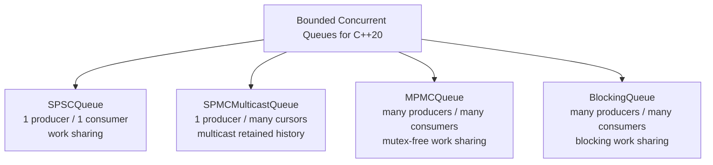
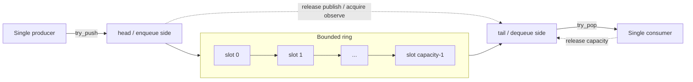
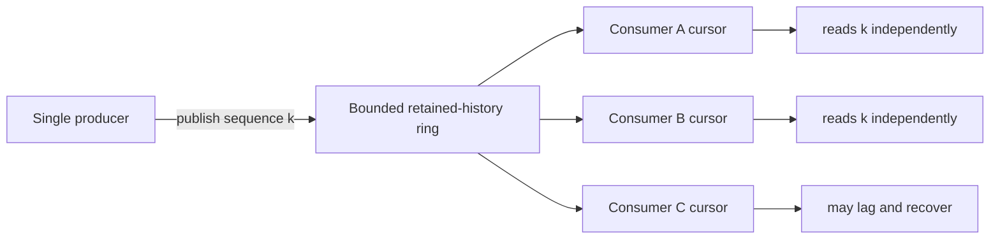
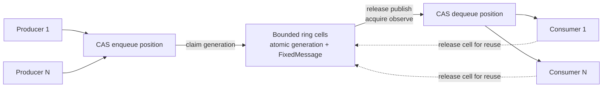
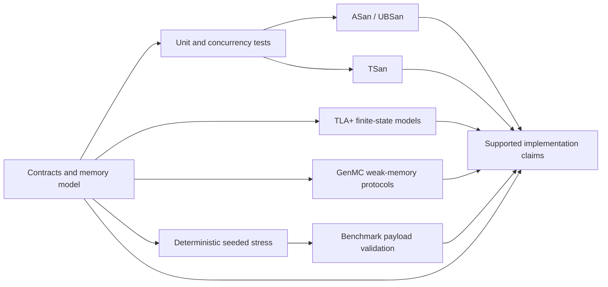

# Bounded Concurrent Queues for C++20

[](https://github.com/suhaasgaddala/bounded-concurrent-queues/actions/workflows/ci.yml)
[](https://github.com/suhaasgaddala/bounded-concurrent-queues/actions/workflows/verification.yml)
[](https://en.cppreference.com/w/cpp/20)
[](LICENSE)

C++20 bounded concurrent queues with SPSC, multicast SPMC, mutex-free MPMC,
stress tests, sanitizers, and reproducible benchmarks.

The project studies bounded in-memory queues with named producer and consumer
contracts, fixed-size payload storage where applicable, explicit operation
results, and benchmark scenarios that preserve the meaning of each delivery
model. Correctness checks and synchronization rationale are part of the design,
not inferred from throughput.

## At a glance

- Header-only C++20 library with no mandatory third-party dependency.
- Includes SPSC, multicast SPMC, blocking MPMC, and mutex-free MPMC queue
  contracts.
- Uses deterministic stress validation, ASan/UBSan and TSan build paths, TLA+
  models, and GenMC protocol artifacts.
- Emits reproducible JSON benchmark output with payload validation.
- Explicitly does not claim production readiness, complete formal
  verification, lock-freedom, or wait-freedom.

## Queue Contracts

| Queue | Concurrency | Delivery | Implementation |
| --- | --- | --- | --- |
| `SPSCQueue<N>` | Single producer, single consumer | Work sharing | Bounded fixed-payload ring with acquire/release head and tail ownership |
| `SPMCMulticastQueue<N>` | Single producer, multiple registered consumers | Multicast retained history | Conservative mutex-protected publication, cursor, and payload-copy protocol |
| `MPMCQueue<N>` | Multiple producers, multiple consumers | Work sharing | Bounded, mutex-free, power-of-two sequence-cell ring with CAS position claims |
| `BlockingQueue<T>` | Multiple producers, multiple consumers | Work sharing | Bounded mutex/condition-variable baseline with close and drain behavior |

The fixed-payload queues accept `std::span`, reject oversized messages, and
return explicit status, byte-count, and logical-sequence results. Queue
contracts differ intentionally: multicast observations are not exclusive pops,
and the MPMC short-destination policy consumes an already claimed message.

## Queue Family Overview



## SPSC Ring Flow



The producer owns `head`; the consumer owns `tail`. Release/acquire handoffs
publish completed payload bytes and prevent a slot from being reused while the
consumer is copying it.

## SPMC Multicast Flow



Each registered consumer advances an independent cursor. Reading does not
remove a publication for other consumers. Slow consumers can lose overwritten
history, receive `consumer_lagged`, and continue from the oldest retained
sequence.

## MPMC Sequence-Cell Flow



The enqueue and dequeue counters allocate unique positions with relaxed CAS.
Per-cell acquire/release generation values transfer ownership of ordinary
payload bytes. Capacity must be a power of two greater than one. The
implementation contains no mutex, but the project does not claim lock-free or
wait-free progress.

## Validation Pipeline



Each layer answers a different question. Tests exercise deterministic
contracts; stress explores many scheduled operations; sanitizers inspect
executed paths; TLC exhaustively checks finite models; GenMC explores reduced
protocols under the C/C++ weak-memory model; benchmark validation rejects
corrupt or inconsistent measured work. None is an unbounded refinement proof of
the complete C++ implementation.

## Design Evidence

### Multicast index exploration


The blue ring captures the index-contention question behind the multicast
research: consumers can advance independently while a producer publishes into
bounded storage. It is design evidence, not the current synchronization
protocol. `SPMCMulticastQueue` owns consumer cursors and uses a mutex across
publication and payload copy to prevent writer/reader data races.

### Benchmark semantics example


The red chart demonstrates why a throughput total needs a delivery contract.
Its SPMC bars count multicast observations while the baselines count exclusive
pops, so the bars are not equivalent work and are not a current performance
claim. The maintained benchmark emits separate publication, aggregate-read,
unique-sequence, retry, and validation fields.

## Quick Start

Requirements: CMake 3.20 or newer and a C++20 compiler.

```sh
cmake -S . -B build -DCMAKE_BUILD_TYPE=Debug
cmake --build build --parallel
ctest --test-dir build --output-on-failure
```

Run the deterministic stress matrix:

```sh
./build/stress/orbitqueue_stress \
  --queue all --seed 12345 --duration-ms 250 --iterations 10000
```

Run one benchmark trial after configuring a Release build:

```sh
cmake -S . -B build-release -DCMAKE_BUILD_TYPE=Release
cmake --build build-release --parallel
./build-release/benchmarks/orbitqueue_benchmark \
  --duration-ms 250 --warmup-ms 50 --trials 1
```

The core library has no mandatory third-party dependency. Tests, benchmarks,
and stress support are enabled by default; optional Boost benchmark scenarios
remain disabled unless `ORBITQUEUE_ENABLE_BOOST_BENCHMARKS=ON` is requested.

## SPSC Usage

```cpp
#include <array>
#include <cstddef>
#include <span>

#include "orbitqueue/spsc_queue.h"

orbitqueue::SPSCQueue<64> queue(1024);

const std::array payload{std::byte{0x10}, std::byte{0x20}};
const auto write = queue.try_push(std::span<const std::byte>{payload});

std::array<std::byte, 64> destination{};
const auto read = queue.try_pop(std::span<std::byte>{destination});

if (write.status != orbitqueue::QueueStatus::success ||
    read.status != orbitqueue::QueueStatus::success) {
    // Handle full, empty, or payload-boundary status as appropriate.
}
```

Exactly one producer thread may call `try_push`, and exactly one consumer
thread may call `try_pop`.

## MPMC Usage

```cpp
#include <array>
#include <cstddef>
#include <span>

#include "orbitqueue/mpmc_queue.h"

orbitqueue::MPMCQueue<128> queue(1024); // Power-of-two capacity.

const std::array payload{std::byte{0x2A}};
const auto write = queue.try_push(std::span<const std::byte>{payload});

std::array<std::byte, 128> destination{};
const auto read = queue.try_pop(std::span<std::byte>{destination});
```

Multiple producer and consumer threads may use the MPMC queue concurrently.
Operations are try-only. There is no close operation. A destination shorter
than the claimed message returns `message_too_large` and consumes that message.

## Install and Consume

```sh
cmake --install build-release --prefix "$HOME/.local"
```

The public display identity changed without breaking the current source and
package interface. Existing consumers continue to use:

```cmake
find_package(OrbitQueue 2 CONFIG REQUIRED)
target_link_libraries(your_target PRIVATE OrbitQueue::orbitqueue)
```

The installed package name, `include/orbitqueue` path, `orbitqueue` namespace,
exported target, version macros, and `ORBITQUEUE_*` CMake options are retained
for compatibility. Renaming those surfaces requires a separate migration plan.

## Correctness and Validation

The repository includes:

- deterministic boundary and concurrent queue tests;
- isolated public-header compilation checks;
- a 50,000-message MPMC contention test with uniqueness and checksum checks;
- seeded stress scenarios with sequence-bearing, reproducible payloads;
- separate ASan/UBSan and TSan build paths;
- an install, `find_package`, compile, and runtime downstream-package test;
- benchmark smoke tests that fail on payload or delivery-accounting errors.

See [the memory model](docs/memory_model.md),
[correctness strategy](docs/correctness_strategy.md), and
[stress guide](docs/stress_testing.md) for the evidence and its limits.

## Benchmark Semantics

`messages_published` counts accepted writes. `aggregate_reads` counts all
successful reads across consumers. `unique_sequences_verified` counts distinct
validated payload IDs.

For work-sharing queues, a completed drain should produce one validated read
per publication. For multicast, several consumers may read the same
publication, so aggregate reads are not unique deliveries and cannot be ranked
as equivalent work. Results include validation counters and provenance, but
they remain sensitive to scheduling, topology, compiler flags, and validation
overhead. See [docs/benchmarking.md](docs/benchmarking.md).

## Non-Claims

- The library is not production-ready or formally verified.
- Not all queues are lock-free; some deliberately use mutexes.
- Mutex-free does not automatically mean lock-free or wait-free.
- Benchmark completion is not proof of correctness.
- Throughput from different delivery semantics is not directly comparable.
- Position and logical-sequence exhaustion remains unsupported.

## Documentation

- [Architecture](docs/architecture.md)
- [Queue contracts](docs/queue_contracts.md)
- [MPMC sequence-cell design](docs/mpmc_queue.md)
- [Memory model](docs/memory_model.md)
- [Correctness strategy](docs/correctness_strategy.md)
- [Stress testing](docs/stress_testing.md)
- [Benchmarking](docs/benchmarking.md)
- [Research motivation](docs/research_motivation.md)
- [Queue design decisions](docs/design_decisions.md)
- [Queue design explorations](docs/design_explorations.md)
- [Concurrency verification](verification/README.md)
