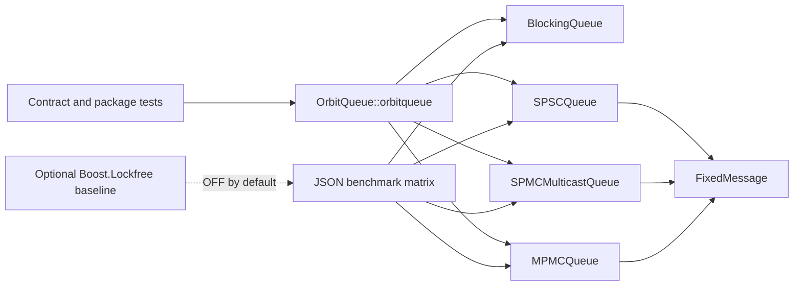

# Architecture

OrbitQueue v2 is a header-only C++20 library. Public headers live under
`include/orbitqueue`, contract tests under `tests`, and measurement code under
`benchmarks`. The `orbitqueue` CMake interface target carries include paths,
language requirements, warnings, and optional sanitizer flags to consumers.

Queue contracts come before optimization because concurrency results are only
meaningful when delivery, capacity, ordering, overwrite, and ownership rules
are defined. The result types make ordinary boundary states inspectable rather
than encoding them as undefined behavior or ambiguous booleans.

The old prototype was rebuilt instead of patched because its global types,
raw callback writes, caller-managed indices, synchronization protocol, build
assumptions, and benchmark semantics did not provide a stable foundation.
The v2 code does not reuse its queue algorithms.

`SPSCQueue` uses monotonic head and tail counters. A producer publishes a fully
written slot with a release store; the consumer observes it with an acquire
load and releases capacity after copying. This relies on exactly one producer
and one consumer.

`SPMCMulticastQueue` uses a mutex around slot publication and consumer copies.
This conservative design prevents a producer from rewriting a payload while a
consumer reads it. Per-consumer sequence cursors identify retained messages
and report lag when ring history has been overwritten. It is not described as
lock-free.

`MPMCQueue` is the bounded fixed-payload work-sharing counterpart to the
generic blocking baseline. It uses a preallocated `FixedMessage` ring and one
mutex to serialize producer publication, consumer claims, close, and retryable
undersized reads. Its public operations are non-blocking in queue semantics:
they return `full`, `empty`, or `closed` instead of waiting.

The benchmark layer is not part of the installed API. Its scenario-specific
drivers preserve queue ownership contracts: SPSC always has one consumer,
while multicast, blocking MPMC, and optional Boost work-sharing queues use one,
three, and ten consumers. Shared benchmark helpers format results and track
monotonic sequence ranges without retaining every observed message.

Boost is discovered only when `ORBITQUEUE_ENABLE_BOOST_BENCHMARKS=ON`. Missing
Boost headers disable those scenarios with a configure-time warning; they do
not affect the core target, tests, installation, or normal benchmark.
