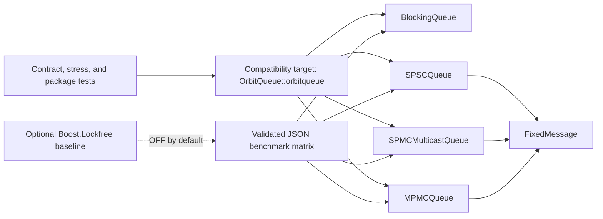

# Architecture

Bounded Concurrent Queues for C++20 is a header-only library. Public headers
live under `include/orbitqueue`, contract tests under `tests`, deterministic
stress code under `stress`, and measurement code under `benchmarks`.

Queue contracts precede optimization. Capacity, producer and consumer
ownership, delivery, ordering, overflow, shutdown, and progress semantics must
be stated before throughput numbers can be interpreted.

## Queue Implementations

`SPSCQueue` uses monotonic head and tail counters. A producer publishes a fully
written slot with a release store; the consumer observes it with an acquire
load and releases capacity after copying. Correctness depends on exactly one
producer and one consumer.

`SPMCMulticastQueue` uses a mutex around publication, cursor inspection, lag
recovery, and payload copies. This prevents a producer from rewriting ordinary
payload bytes while a consumer reads them. Consumers have independent cursors,
so delivery is multicast retained history rather than exclusive work sharing.

### Multicast design evidence

This diagram records the global-index design question: whether localized slot
state can reduce contention while multiple consumers advance through a bounded
ring. The current queue does not implement the depicted index protocol. Its
value is the question it makes inspectable; the implemented synchronization is
the mutex-and-cursor contract described above.

`MPMCQueue` is the bounded fixed-payload work-sharing counterpart. It uses a
preallocated power-of-two cell array, atomic enqueue/dequeue position claims,
and per-cell acquire/release generation sequences. Payload bytes are copied
only while a thread owns the cell. The implementation contains no mutex, has
try-only operations, and provides no close operation.

`BlockingQueue<T>` is the generic blocking MPMC baseline. One mutex protects
storage and closure state; condition variables wait for non-empty and non-full
predicates. Close wakes waiters and preserves queued items for draining.

## Package Compatibility

The root CMake project identifier is `BoundedConcurrentQueues`. Existing source
and package compatibility remains intentionally unchanged:

- installed package: `OrbitQueue`;
- exported target: `OrbitQueue::orbitqueue`;
- public-name alias: `BoundedConcurrentQueues::orbitqueue`;
- include path: `include/orbitqueue`;
- C++ namespace: `orbitqueue`;
- build options and version macros: `ORBITQUEUE_*`.

These compatibility names are retained for existing consumers and are not old
project branding. The CMake project version follows the public release line.
The current interface target still carries C++20, include paths, warnings, and
optional sanitizer flags to consumers.

## Measurement Boundary

The benchmark layer is not part of the installed API. Scenario-specific
drivers preserve ownership contracts: SPSC remains one producer/one consumer,
SPMC reports multicast observations, and work-sharing queues validate unique
delivery after drain. Shared helpers retain validated IDs to detect duplicate
or missing work.

Boost is discovered only when `ORBITQUEUE_ENABLE_BOOST_BENCHMARKS=ON`. Missing
headers disable those optional scenarios without affecting the core library,
tests, installation, stress runner, or normal benchmark.
