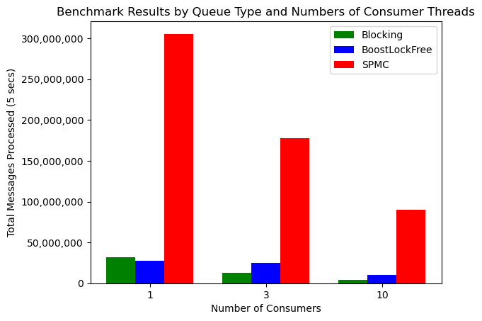
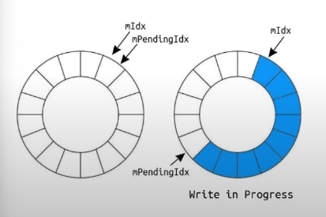

# OrbitQueue v1 Historical Artifacts

This directory preserves the useful historical context needed after retirement
of the original OrbitQueue repository. These files are not current v2 designs,
performance results, or implementation recommendations.

## Preserved context

OrbitQueue v1 was inspired by the CppCon 2022 talk
[Trading at Light Speed](https://youtu.be/8uAW5FQtcvE). It explored whether
per-slot version metadata could reduce contention compared with global queue
indices. It also drafted an SPSC no-overwrite protocol and compared its
multicast experiment with work-sharing queues.

Those were useful research questions, but the implementation did not establish
that its non-atomic payload access was race-free. OrbitQueue v2 preserves the
questions and delivery models while replacing the algorithms with bounded APIs,
explicit sequences, tests, and conservative synchronization.

## Files

- `v1_project_context.md`: full technical audit of the legacy repository at
  commit `efbddb4`.
- `assets/spmc_global_indices_v1.png`: historical illustration of a ring using
  global index metadata.
- `assets/benchmark_v1_historical.png`: historical five-second bar chart for
  one, three, and ten consumers.
- `LICENSE.v1`: original MIT copyright and permission notice covering the
  migrated historical material.

## Historical benchmark warning

The chart is not a v2 benchmark result and must not be used as evidence that
one queue is faster than another. Its raw observations, compiler configuration,
hardware description, and generation script were not retained. More
importantly, its SPMC bars count multicast reads while the blocking and Boost
bars count exclusive work-sharing pops. Those totals are not equivalent units.

## Historical architecture image

The global-index image is useful for understanding the design direction that
v1 was reacting to. It is not a diagram of the current v2 implementation.

